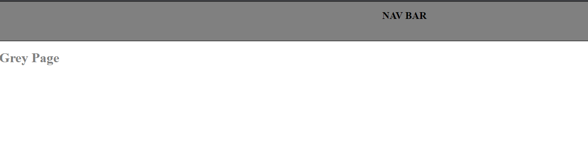

# Rainbow-Routes 

### This Page give a function to put color on navigation bar and page content to certain color that you can type in the URL.

***

#### exmaple - http://localhost:3000/[type color here]
#### exmaple - http://localhost:3000/grey

***

## Technologies

- Express app
- Typescript
- Nodemon

***

## Installation
### Run in terminal
- npm install
- npm install -g typescript
### Run the project
- nodemon src/index.ts